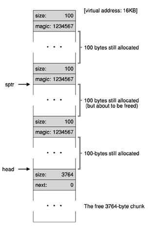

# Memory Manager

This is a program that manages the virtual address space of the heap memory in the operating system. The program simulates the C dynamic  memory allocation functions such as `malloc()` and `free()`. This memory manager has three tasks: ask the operating system to expand the heap portion of a process' address space, allocate the given memory space to the calling process, and add the memory space back to a list of free memory chunks when the process is finished. 

Each memory block has a header, followed by a space that is either allocated or free. The header includes two pieces of information: the size of the free chunk and a field of number. In an allocated chunk, this field contains a "magic number" - an arbitrarily designated number used to identify an allocated space. In a free chunk, this field contains the address of the next item in the list of free memory blocks. 

An example of this process: assume that inititally, the user requests 4KB (or 4096 bytes) from the operating system for the heap. Since each field in the header is an integer, its size is 4 bytes. Thus, the total size of the header is 8 bytes. The free space is 4096 - 8 = 4088 bytes, which is saved into the `size` field of the header. `head` is the pointer to the beginning of the free list, and it points to the header of this chunk. 

Suppose 100 bytes is allocated and identified by the pointer `ptr`. The header then shows the size of 100 and the arbitrary number of 1234567. `head` pointer points to after the allocated chunk, with a new header that shows the size (4088 - 100 - 8 = 3980) and the address of the next free chunk (since it is the only free chunk, the address is 0).

Suppose two more 100-byte chunks are allocated (left figure below). The size of the free chunk is now 3764 (= 3980 - 100 - 8 - 100 - 8). If the second chunk is freed, its `next` field will contain the address of the pointer to next free chunk (right figure below).

         

As a result, we have a two allocated chunks identified by magic number, and list of 2 free chunks of size 100 bytes and 3764 bytes.

On a side note, the memory manager operates entirely within the virtual address space of a single process. It does not know about the physical pages allocated to this process, the mapping from virtual addresses to physical addresses, or about any other processes that are running.

## Requesting memory space

When a process calls the method `Mem_Init()`, the memory manager requests memory from the operating system. It first uses the fuction `mmap()` in C, and then creates the header of the newly obtained region and finally returns the head pointer to the free list. 

## Allocating memory

Method `Mem_Alloc()` behaves similarly to the ready-made `malloc()` function in C. When the process calls this method, the memory manager searches for an available and large enough memory block within the free list, and allocates the block according to the need of the calling process. It then returns the pointer to the allocated memory space.

## Freeing Memory

Method `Mem_Free()` behaves similarly to `free()` function in C. When the process calls this method, the memory manager frees the memory space pointed to by a given pointer and adds this space to the free list. 

## File description

- [mem.h](https://github.com/vantrinh7/MemoryManager/blob/master/mem.h) is the file that defines the prototypes for methods in the memory manager, such as `Mem_Init()`, `Mem_Alloc()` or `Mem_Free()`.
- [mem.c](https://github.com/vantrinh7/MemoryManager/blob/master/mem.c) includes `mem.h` and is the source file.
- [libmem.so](https://github.com/vantrinh7/MemoryManager/blob/master/libmem.so) is a Shared Object file that links to the source file. This makes the source file a shared library that can be included into other source files dynamically and creates small executables (as opposed to a static library that does not enable users to use the most updated version of the library at run time, and creates large executable files).
- [makefile](https://github.com/vantrinh7/MemoryManager/blob/master/makefile) includes rules for creating a shared library and constructing test file. 
- [memtest.c](https://github.com/vantrinh7/MemoryManager/blob/master/memtest.c) is a test file that utilizes the memory manger. [expected_output.txt](https://github.com/vantrinh7/MemoryManager/blob/master/expected_output.txt) is the expected output when running memtest.c. The memory manager may be tested in any other file by adapting from this example.

Note: Before memtest.c is run, an environment variable, LD_LIBRARY_PATH, needs to be set, so that the system can find the library at run-time. Assuming `memtest.c` is run from the directory where it is stored, this command should be used before running the file: `export LD_LIBRARY_PATH=.:$LD_LIBRARY_PATH`.

 

(Image source: [Operating System - Three Easy Pieces](http://pages.cs.wisc.edu/~remzi/OSTEP/), Chapter 17).
